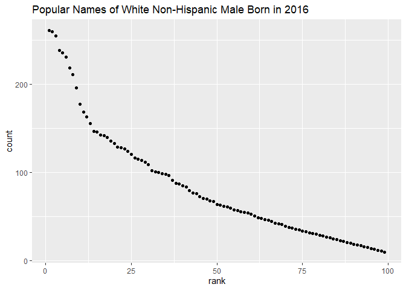

p8105\_hw2\_yo2336
================
Yoo Rim Oh

# Problem 1

## Read Mr.Trash excel data and clean

Named the data frame as trash\_df and set the range to omit the note
sections without any data. Removed all missing values (non-dumpster
specific data) under dumpster column and mutated sports\_balls column to
integer from doubles.

``` r
trash_df = 
  read_excel("data/trash_wheel_updated.xlsx", sheet = "Mr. Trash Wheel", 
             range = cell_cols("A:N")) %>%
  janitor::clean_names() %>%
  drop_na(dumpster) %>%
  mutate(sports_balls = as.integer(sports_balls))
```

## Read Precipitation Data (2018 & 2019) then clean and bind

Named the data frame as precip\_df\_2018 and precip\_df\_2019 and set
the range to only show observations and not totals. Renamed the Total
column to precipitation\_in and added an additional column for year data
was collected for both data sets. Arranged both data sets so that year
variable comes first.

Combined two data sets using bind\_rows and changed month column to
convert numeric form of month to character month names.

``` r
precip_df_2018 =
  read_excel("data/trash_wheel_updated.xlsx", sheet = "2018 Precipitation", 
             range = "A2:B14") %>%
  janitor::clean_names() %>%
  rename(precipitation_in = total) %>%
  mutate(year = 2018) %>%
  relocate(year)


precip_df_2019 =
  read_excel("data/trash_wheel_updated.xlsx", sheet = "2019 Precipitation", 
             range = "A2:B14") %>%
  janitor::clean_names() %>%
  rename(precipitation_in = total) %>%
  mutate(year = 2019) %>%
  relocate(year)


precip_df =
  bind_rows(precip_df_2018, precip_df_2019) %>%
  janitor::clean_names() %>%
  mutate(month = month.name[as.numeric(month)])
```

## Trash Wheel and Precipitation Data Description

``` r
ncol(trash_df)
```

    ## [1] 14

``` r
names(trash_df)
```

    ##  [1] "dumpster"           "month"              "year"              
    ##  [4] "date"               "weight_tons"        "volume_cubic_yards"
    ##  [7] "plastic_bottles"    "polystyrene"        "cigarette_butts"   
    ## [10] "glass_bottles"      "grocery_bags"       "chip_bags"         
    ## [13] "sports_balls"       "homes_powered"

``` r
nrow(trash_df)
```

    ## [1] 454

``` r
ncol(precip_df)
```

    ## [1] 3

``` r
names(precip_df)
```

    ## [1] "year"             "month"            "precipitation_in"

``` r
nrow(precip_df)
```

    ## [1] 24

``` r
nrow(precip_df_2018)
```

    ## [1] 12

``` r
nrow(precip_df_2019)
```

    ## [1] 12

``` r
sum(pull(precip_df_2018, precipitation_in))
```

    ## [1] 70.33

``` r
median(pull(filter(trash_df, year == 2019), sports_balls))
```

    ## [1] 9

The Mr.Trash Wheel Data has 14 columns representing variables such as
dumpster number, month/year/date that specific dumpster was collected,
weight and volume of the dumpster, 8 different types of trash
categories, and homes powered. It has total of 454 rows representing the
total number of observations, or dumpster specific data, collected
between May 2014 to January 2021.

The combined Precipitation Data during 2018 and 2019 has 3 columns for
year and month of when the data was collected and precipitation in
inches. It has total of 24 rows representing the total number of
observations taken every month each year.

The total precipitation in 2018 was 70.33 in. The median number of
sports balls found in a dumpster in 2019 was 9.

# Problem 2

## Part 1 Read and clean pols-month.csv

Named the data frame as pols\_month\_df. Reorganized the date to have
individual columns for year, month, and day each and converted month to
character month name. Reorganized so prez\_gop and prez\_dem lined up
together in order to use pivot\_longer. Changed column names to gop and
dem instead of prez\_gop and prez\_dem so when combined together, any
observation not 0 as its value will be reassigned to new values either
gop or dem. Rearranged so data set begins with year, month, and
president variables.

``` r
pols_month_df =
  read_csv("data/fivethirtyeight_datasets/pols_month.csv") %>%
  janitor::clean_names() %>%
  separate(mon, into = c("year", "month", "day")) %>%
  mutate(month = month.name[as.numeric(month)]) %>%
  relocate(year, month, prez_gop, prez_dem) %>%
  rename(gop = prez_gop, dem = prez_dem) %>%
  pivot_longer(
    gop:dem,
    names_to = "president",
    values_to = "prez_numeric") %>%
  filter(prez_numeric != 0) %>%
  select(-c("prez_numeric", "day")) %>%
  relocate(year, month, president)
```

    ## Rows: 822 Columns: 9

    ## -- Column specification --------------------------------------------------------
    ## Delimiter: ","
    ## dbl  (8): prez_gop, gov_gop, sen_gop, rep_gop, prez_dem, gov_dem, sen_dem, r...
    ## date (1): mon

    ## 
    ## i Use `spec()` to retrieve the full column specification for this data.
    ## i Specify the column types or set `show_col_types = FALSE` to quiet this message.

## Part 2 Read and clean snp.csv

Named data frame as snp\_df. Used lubridate::mdy() to convert date in
m/d/yy form to yyyy-mm-dd format then separated to create columns for
each year, month, and day. Converted month variable to full month name
character, removed day column, and rearranged according to year and
month.

``` r
snp_df =
  read_csv("data/fivethirtyeight_datasets/snp.csv") %>%
  janitor::clean_names() %>%
  mutate(date = lubridate::mdy(date)) %>%
  separate(date, into = c("year", "month", "day")) %>%
  arrange(year, month) %>%
  mutate(month = month.name[as.numeric(month)]) %>%
  select(-"day")
```

    ## Rows: 787 Columns: 2

    ## -- Column specification --------------------------------------------------------
    ## Delimiter: ","
    ## chr (1): date
    ## dbl (1): close

    ## 
    ## i Use `spec()` to retrieve the full column specification for this data.
    ## i Specify the column types or set `show_col_types = FALSE` to quiet this message.

## Part 3 Read and clean unemployment.csv

Named the data frame as unemp\_df and used pivot\_longer to transform
individual month columns to one column named month. Converted
abbreviated month names to numeric then to full month name character.

``` r
unemp_df =
  read_csv("data/fivethirtyeight_datasets/unemployment.csv") %>%
  pivot_longer(
    Jan:Dec,
    names_to = "month",
    values_to = "percent_unemployment") %>%
  mutate(month = month.name[match(month, month.abb)]) %>%
  janitor::clean_names()
```

    ## Rows: 68 Columns: 13

    ## -- Column specification --------------------------------------------------------
    ## Delimiter: ","
    ## dbl (13): Year, Jan, Feb, Mar, Apr, May, Jun, Jul, Aug, Sep, Oct, Nov, Dec

    ## 
    ## i Use `spec()` to retrieve the full column specification for this data.
    ## i Specify the column types or set `show_col_types = FALSE` to quiet this message.

## Join snp and pols data

Combined pols\_month and snp using left join by year and month
variables. Converted year column as numeric (doubles column) instead of
character column.

``` r
snp_pols_df =
  left_join(pols_month_df, snp_df, by = c("year", "month")) %>%
  janitor::clean_names() %>%
  mutate(year = as.numeric(year))
```

## Join combined snp\_pols with unemployment

Combined the above snp\_pols joined data to unemp data using left\_join
by year and month.

``` r
snp_pols_unemp_df =
  left_join(snp_pols_df, unemp_df, by = c("year", "month")) %>%
  janitor::clean_names()
```

## FiveThirtyEight data description

``` r
ncol(pols_month_df)
```

    ## [1] 9

``` r
names(pols_month_df)
```

    ## [1] "year"      "month"     "president" "gov_gop"   "sen_gop"   "rep_gop"  
    ## [7] "gov_dem"   "sen_dem"   "rep_dem"

``` r
nrow(pols_month_df)
```

    ## [1] 822

``` r
range(pull(pols_month_df, year))
```

    ## [1] "1947" "2015"

``` r
ncol(snp_df)
```

    ## [1] 3

``` r
names(snp_df)
```

    ## [1] "year"  "month" "close"

``` r
nrow(snp_df)
```

    ## [1] 787

``` r
range(pull(snp_df, year))
```

    ## [1] "1969" "2068"

``` r
ncol(unemp_df)
```

    ## [1] 3

``` r
names(unemp_df)
```

    ## [1] "year"                 "month"                "percent_unemployment"

``` r
nrow(unemp_df)
```

    ## [1] 816

``` r
range(pull(snp_df, year))
```

    ## [1] "1969" "2068"

The pols\_month data has 9 columns representing variables such as
year/month, president for which party (democrat as dem and republican as
gop) that year’s president belonged, and number of each party’s
governors, senators, and representatives at the time. It has 822 rows
for total number of observations ranging from the years 1947 to 2015
every month.

The snp data has 3 columns representing variables year, month, and close
for closing values of the S&P stock index at the time. It has 787 rows
for total number of observations ranging from the years 1969 to 2068
every month.

The unemployment data has 3 columns representing variables year, month,
and percent unemployment at the time of data collection. It has 816 rows
for total number of observations ranging from the years 1969 to 2068
every month.

# Problem 3

## Load and clean baby\_name data

Named data frame as baby\_name\_df and used unique() to remove any
duplicate observations. Rearranged so data started with year, rank, and
name and arranged according to year and ethnicity. Recoded so all
ethnicity variables are unified and changed ethnicity and
childs\_first\_name values to be in lower case.

``` r
baby_name_df =
  read_csv("data/Popular_Baby_Names.csv") %>%
  janitor::clean_names() %>%
  unique() %>%
  relocate(year_of_birth, rank, childs_first_name) %>%
  arrange(year_of_birth, ethnicity) %>%
  mutate(ethnicity = recode(ethnicity, "ASIAN AND PACI" = "ASIAN AND PACIFIC ISLANDER", 
                  "BLACK NON HISP" = "BLACK NON HISPANIC", 
                  "WHITE NON HISP" = "WHITE NON HISPANIC"),
         ethnicity = str_to_lower(ethnicity),
         childs_first_name = str_to_lower(childs_first_name))
```

    ## Rows: 19418 Columns: 6

    ## -- Column specification --------------------------------------------------------
    ## Delimiter: ","
    ## chr (3): Gender, Ethnicity, Child's First Name
    ## dbl (3): Year of Birth, Count, Rank

    ## 
    ## i Use `spec()` to retrieve the full column specification for this data.
    ## i Specify the column types or set `show_col_types = FALSE` to quiet this message.

## Create table for name Olivia

Created a new data frame named baby\_name\_tbl for name Olivia only.
Used pivot\_wider to assign individual columns for each ethnicity and
the ranks to be their values. Removed all irrelevant columns for name
Olivia. Created data frame for each ethnicity separately and removed all
missing values. Then joined the 4 ethnicity based data frames together
back again to show ranks of name Olivia for each ethnicity each year.
Created table using knitr::kable of the joined data frame.

``` r
baby_name_tbl = 
    pivot_wider(baby_name_df,
           names_from = "ethnicity",
           values_from = "rank") %>%
    filter(childs_first_name == "olivia") %>%
    select(-c("childs_first_name", "gender", "count"))

aapi_olivia = select(baby_name_tbl, year_of_birth, "asian and pacific islander") %>%
  drop_na("asian and pacific islander")
bnh_olivia = select(baby_name_tbl, year_of_birth, "black non hispanic") %>%
  drop_na("black non hispanic")
h_olivia = select(baby_name_tbl, year_of_birth, "hispanic") %>%
  drop_na("hispanic")
wnh_olivia = select(baby_name_tbl, year_of_birth, "white non hispanic") %>%
  drop_na("white non hispanic")

olivia_tbl = left_join(aapi_olivia, left_join(bnh_olivia, left_join(h_olivia, wnh_olivia)))
```

    ## Joining, by = "year_of_birth"
    ## Joining, by = "year_of_birth"
    ## Joining, by = "year_of_birth"

``` r
knitr::kable(olivia_tbl, caption = "Rank in Popularity for Baby's Name Olivia")
```

| year\_of\_birth | asian and pacific islander | black non hispanic | hispanic | white non hispanic |
|----------------:|---------------------------:|-------------------:|---------:|-------------------:|
|            2011 |                          4 |                 10 |       18 |                  2 |
|            2012 |                          3 |                  8 |       22 |                  4 |
|            2013 |                          3 |                  6 |       22 |                  1 |
|            2014 |                          1 |                  8 |       16 |                  1 |
|            2015 |                          1 |                  4 |       16 |                  1 |
|            2016 |                          1 |                  8 |       13 |                  1 |

Rank in Popularity for Baby’s Name Olivia

## Create table for popular male name Ethan

Same flow as table for Olivia above except for baby name Ethan.

``` r
male_name_tbl = 
    pivot_wider(baby_name_df,
           names_from = "ethnicity",
           values_from = "rank") %>%
    filter(childs_first_name == "ethan") %>%
    select(-c("childs_first_name", "gender", "count"))

aapi_ethan = select(male_name_tbl, year_of_birth, "asian and pacific islander") %>%
  drop_na("asian and pacific islander")
bnh_ethan = select(male_name_tbl, year_of_birth, "black non hispanic") %>%
  drop_na("black non hispanic")
h_ethan = select(male_name_tbl, year_of_birth, "hispanic") %>%
  drop_na("hispanic")
wnh_ethan = select(male_name_tbl, year_of_birth, "white non hispanic") %>%
  drop_na("white non hispanic")

ethan_tbl = left_join(aapi_ethan, left_join(bnh_ethan, left_join(h_ethan, wnh_ethan)))
```

    ## Joining, by = "year_of_birth"
    ## Joining, by = "year_of_birth"
    ## Joining, by = "year_of_birth"

``` r
knitr::kable(ethan_tbl, caption = "Rank in Popularity for Baby's Name Ethan")
```

| year\_of\_birth | asian and pacific islander | black non hispanic | hispanic | white non hispanic |
|----------------:|---------------------------:|-------------------:|---------:|-------------------:|
|            2011 |                          1 |                  6 |        6 |                 26 |
|            2012 |                          2 |                  3 |        4 |                 21 |
|            2013 |                          2 |                  1 |        5 |                 23 |
|            2014 |                          2 |                  1 |        5 |                 18 |
|            2015 |                          2 |                  5 |        3 |                 19 |
|            2016 |                          1 |                  5 |        7 |                 20 |

Rank in Popularity for Baby’s Name Ethan

## Scatter plot for names of white non hispanic male born in 2016

Created a data frame named white\_male\_2016 first with only male names
from 2016 ranked for white non hispanic group. Then used
ggplot()/geom\_point to create scatter plot with rank on x-axis and
count on y-axis.

``` r
white_male_2016 =
  filter(baby_name_df, gender == "MALE", 
         ethnicity == "white non hispanic", 
         year_of_birth == 2016)

ggplot(white_male_2016, aes(x = rank, y = count)) +
  geom_point() +
    labs(title = "Popular Names of White Non-Hispanic Male Born in 2016")
```

<!-- -->
